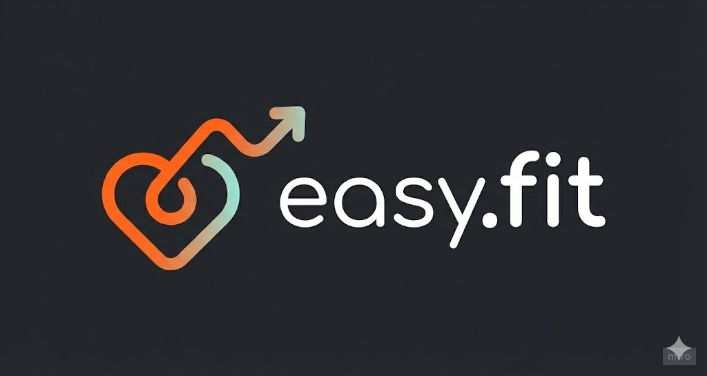
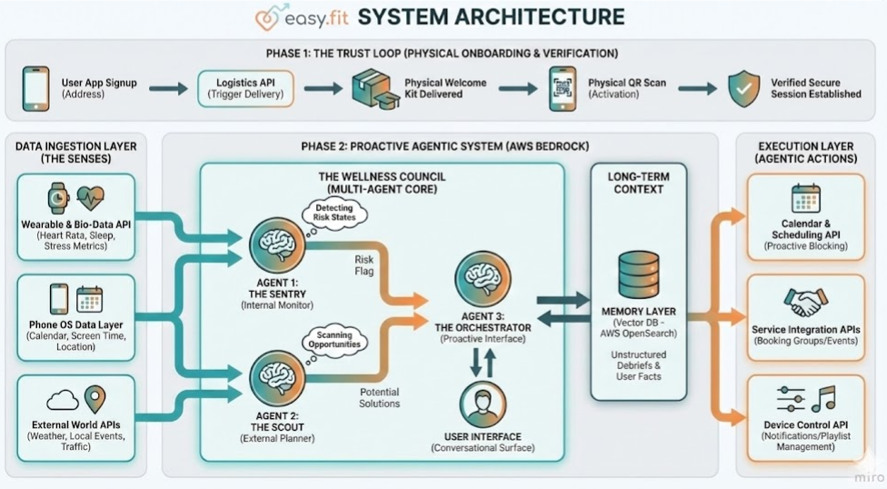
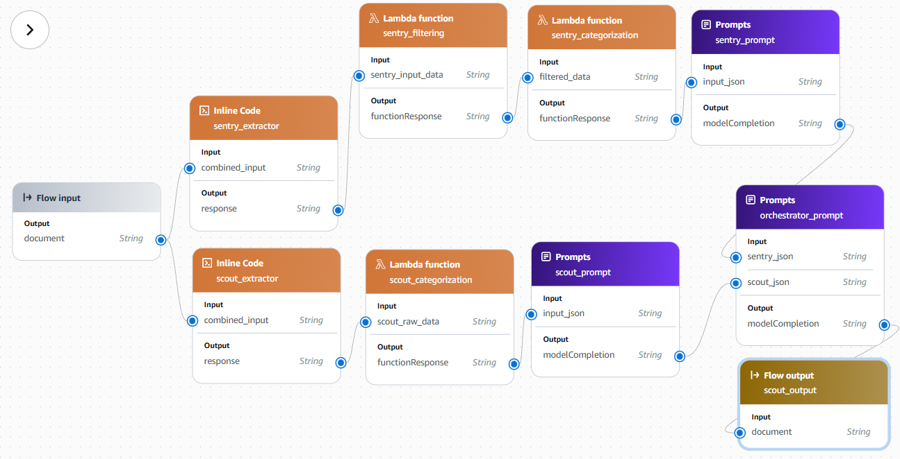

# easy.fit

[Slides to the 3-minute pitch](https://docs.google.com/presentation/d/1PzlXFOk4G-1eHB2sMWoBN4ow2-l56I00fscoXD49MBY/edit?usp=drivesdk)

## Authors 

[Anish Pathak](https://www.linkedin.com/in/anish-pathak5)

[Abel Safran](https://www.linkedin.com/in/safranabel)

## Architecture Diagram

## Repository Structure

- `mock_data`: Contains mock data used for testing and development.

- `img`: Contains images used in the documentation and application.

- `frontend`: Contains the mock frontend application code.

- `schemas`: Contains JSON schema definitions for data validation.

- `flow_components`: Contains the AWS flow components used in the pipeline. See the flow below.

## AWS Flow Diagram

## Description of easy.fit

### Inspiration

We live in a hyper-connected world, yet the loneliness epidemic is accelerating. From the elderly facing neurodegenerative risks due to isolation, to expats lost in new cities, and busy students whose relationships decay due to "lack of time"—the problem isn't that people don't want to be healthy or social. The problem is the friction of logistics.

Existing apps are passive; they nag you with notifications saying, "You should go for a walk" or "Call your mother." We realized that advice is cheap, but execution is hard. We wanted to build something that doesn't just suggest a better life but actively handles the logistics to make it happen. We wanted to move from Notification to Action.

### What it does

easy.fit is a holistic wellness agent that combats loneliness and improves physical health by proactively integrating habits into your life. It is not a passive app; it is an agentic system that fills the "empty spaces" in your day with positive actions.

It operates through three key journeys:

- The Community Broker (Combating Isolation): Instead of just suggesting a walk, easy.fit identifies a route through a local park, detects a walking group starting there in 20 minutes, and proactively asks to reserve a spot for you via API. It lowers the barrier to entry for social contact.

- The Relationship Bridge (Maintaining Bonds): It monitors relationship decay. If you haven't spoken to a close friend in two weeks, it finds a mutual free slot and tentatively blocks the time. Crucially, it uses a "Debrief Loop": if you tell the agent "Mom is moving house," it stores this in long-term memory and reminds you to ask about the move next time, deepening the bond.

- The Bio-Rhythm Governor (Real-Time Intervention): It acts on real-time bio-data. If wearables detect high stress, it doesn't send a text. It might proactively pause phone notifications for 5 minutes and change your Spotify playlist to calming music to force a biological reset.

### How we built it

We architected the system as "The Wellness Council"—a set of specialized agents built on AWS Bedrock that work in tandem rather than a single monolithic bot.

- Inputs: We ingest real-time data from Wearables (Heart rate, steps), Phone Data (Calendar, Screen time), and External APIs (Weather, Events).

- Agent 1: The Sentry (Internal Monitor): A passive agent that constantly monitors bio-data to flag "Risk States" (e.g., High Stress + Isolation).

- Agent 2: The Scout (External Planner): A passive agent that scans the outside world (APIs for events, traffic, weather) to find opportunities that match the user's profile.

- The Memory Layer (Mocked, not implemented): A Vector Database that stores unstructured data from user "Debriefs" to provide long-term context.

- Agent 3: The Orchestrator (The Interface): The active persona the user interacts with. It receives the risk flag from the Sentry, requests a solution from the Scout, consults Memory, and executes Actions via APIs (Calendar blocking, booking services, controlling app settings).

### Challenges we ran into

The "Agentic" Balance: It was difficult to tune the Orchestrator so that it felt proactive without being intrusive.

AWS Permissions: Setting up the right IAM roles for Bedrock agents to access other AWS services was more complex than anticipated.

### Accomplishments that we're proud of

True Proactivity: We moved beyond text generation. Our idea of agents taking real-world actions (booking, calendar management) is a significant step forward. The system helps users not just plan but execute wellness activities.

### What we learned

Agents need Roles: Treating the AI as a "Council" of specialists (Sentry vs. Scout) made the system much more robust and easier to debug than one giant prompt.

Loneliness is a Logistics Problem: Often, people are lonely not because they lack friends, but because the friction of organizing a meetup is too high. AI is perfect for removing that friction.

### What's next for easy.fit

Our application is showing a concept prototype of easy.fit with mock data and limited integrations. The next steps include:

- Integration with real data.
- Mobile App Development: Creating a seamless mobile experience for users to interact with their wellness agent on the go.
- Database Integration: Implementing a vector database for long-term memory storage to enhance personalized interactions.
- Refining Prompts: Continuously improving the prompts for each agent to enhance their effectiveness and user experience.

